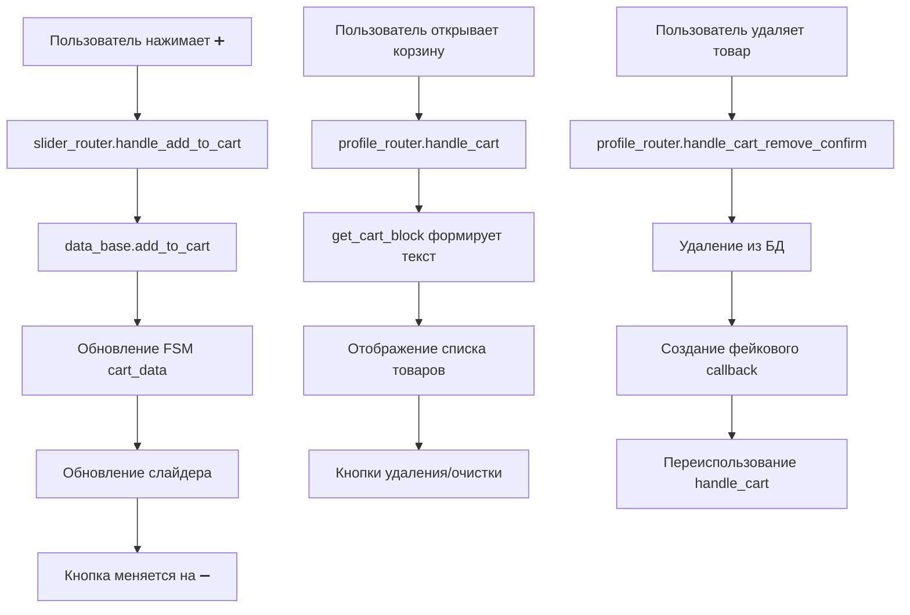

# 🛒 Техническое руководство: Архитектура корзины

## База данных

### Структура таблицы cart
```sql
CREATE TABLE cart (
    id INTEGER PRIMARY KEY AUTOINCREMENT,
    user_id INTEGER NOT NULL,
    product_id INTEGER NOT NULL,
    size_id INTEGER,
    quantity INTEGER NOT NULL DEFAULT 1 CHECK(quantity > 0),
    added_at TIMESTAMP DEFAULT CURRENT_TIMESTAMP,
    FOREIGN KEY (user_id) REFERENCES users(user_id) ON DELETE CASCADE,
    FOREIGN KEY (product_id) REFERENCES products(id) ON DELETE CASCADE,
    FOREIGN KEY (size_id) REFERENCES sizes(id)
);
```

### Индексы для оптимизации
```sql
CREATE INDEX IF NOT EXISTS idx_cart_user ON cart(user_id);
CREATE INDEX IF NOT EXISTS idx_cart_product ON cart(product_id);
CREATE INDEX IF NOT EXISTS idx_cart_user_product ON cart(user_id, product_id);
```

## Основные методы в data_base/models.py

### Добавление товара в корзину
```python
def add_to_cart(self, user_id: int, product_id: int, size_value: str = None, quantity: int = 1) -> None:
    """
    Добавляет товар в корзину или увеличивает количество, если уже есть.
    
    Args:
        user_id: ID пользователя
        product_id: ID товара
        size_value: Значение размера (если есть)
        quantity: Количество (по умолчанию 1)
    """
```

### Получение содержимого корзины
```python
def get_cart(self, user_id: int) -> list:
    """
    Получает содержимое корзины с деталями товара и размера.
    
    Returns:
        Список словарей с полями: id, product_id, size_id, quantity, added_at,
        name, sale_price, discount, brand, category, subcategory, size_value
    """
```

### Проверка наличия товара
```python
def is_product_in_cart(self, user_id: int, product_id: int, size_value: str = None) -> bool:
    """
    Проверяет, находится ли товар в корзине пользователя.
    
    Returns:
        True если товар в корзине, False если нет
    """
```

### Подсчет товаров
```python
def get_cart_count(self, user_id: int) -> int:
    """
    Возвращает общее количество товаров в корзине.
    
    Returns:
        Сумма quantity всех товаров в корзине
    """
```

## Роутеры обработки

### routers/profile_router.py

#### Просмотр корзины
```python
@router.callback_query(NavigationCallback.filter(F.current_level == Profile.CART))
async def handle_cart(callback: CallbackQuery, state: FSMContext, manager: MessageManager):
    """
    Показывает содержимое корзины с кнопками управления.
    Поддерживает breadcrumbs для возврата к источнику.
    """
```

#### Очистка корзины
```python
@router.callback_query(F.data == "cart_clear")
async def handle_cart_clear(callback: CallbackQuery, state: FSMContext, manager: MessageManager):
    """
    Очищает корзину и возвращает на главную.
    Показывает колбек без алерта.
    """
```

#### Удаление товара
```python
@router.callback_query(F.data.startswith("cart_remove:"))
async def handle_cart_remove(callback: CallbackQuery, state: FSMContext, manager: MessageManager):
    """
    Показывает подтверждение удаления товара.
    """

@router.callback_query(F.data.startswith("cart_remove_confirm:"))
async def handle_cart_remove_confirm(callback: CallbackQuery, state: FSMContext, manager: MessageManager):
    """
    Удаляет товар и обновляет корзину.
    Использует фейковый callback для переиспользования handle_cart.
    """
```

### routers/slider_router.py

#### Добавление в корзину
```python
@router.callback_query(F.data.startswith("add_to_cart"))
async def handle_add_to_cart(callback: CallbackQuery, state: FSMContext):
    """
    Добавляет товар в корзину из слайдера.
    Обновляет FSM и синхронизирует состояние.
    """
```

#### Удаление из корзины
```python
@router.callback_query(F.data.startswith("remove_from_cart"))
async def handle_remove_from_cart(callback: CallbackQuery, state: FSMContext):
    """
    Удаляет товар из корзины из слайдера.
    Обновляет FSM и синхронизирует состояние.
    """
```

## Утилиты отображения

### utils/functions.py

#### Полный блок корзины
```python
def get_cart_block(user_id: int) -> str:
    """
    Формирует полный блок корзины с товарами, расчетом скидок и итоговой суммой.
    
    Features:
    - Подсчет общего количества товаров
    - Расчет персональной скидки
    - Отображение в тегах <code></code>
    - Форматирование цен в евро и гривнах
    """
```

#### Компактный блок корзины
```python
def get_cart_block_short(user_id: int) -> str:
    """
    Формирует компактный блок корзины для слайдера.
    
    Returns:
        "🛍 X прод.\nСума: Y.YY €" или "🛍 Кошик: порожній"
    """
```

#### Расчет скидок
```python
def calculate_cashback(user_id: int, purchase_amount: float) -> dict:
    """
    Рассчитывает персональную скидку на основе баллов лояльности.
    
    Returns:
        {
            "discount": float,           # Сумма скидки в евро
            "total_percentage": float,   # Общий процент скидки
            "final_price": float,        # Итоговая цена
            "purchase_percentage": float, # Процент от покупок
            "referral_percentage": float, # Процент от рефералов
            "activity_percentage": float  # Процент от активности
        }
    """
```

## Интеграция с интерфейсом

### keyboards/kb.py

#### Кнопка корзины в главном меню
```python
def create_main_menu_keyboard(user_id: int, breadcrumbs: str = "", action: str = "main", active_filters: dict = None):
    # Получаем количество товаров в корзине
    cart_count = data_base.get_cart_count(user_id)
    
    # Создаем кнопку только если есть товары
    if cart_count > 0:
        cart_button = InlineKeyboardButton(
            text=f"🛍 {cart_count} тов.",
            callback_data=NavigationCallback(
                action="main",
                current_level="cart",
                breadcrumbs="main"
            ).pack()
        )
```

#### Кнопки в слайдере
```python
def get_slider_keyboard(paused=False, expanded=True, index=0, total=0, user_id=None, is_favorite=False,
                        cart_not_empty=False, product_id=None, source="main", is_in_cart=False):
    # Кнопка корзины: ➕ или ➖
    cart_btn_text = "➖" if is_in_cart else "➕"
    cart_btn_callback = f"remove_from_cart:{product_id}" if is_in_cart else f"add_to_cart:{product_id}"
```

### utils/slider_manager.py

#### Отображение корзины в caption
```python
async def get_full_slider_caption(self, product_id: int, user_id: Optional[int], cart_items: Optional[list] = None, show_cart_block: bool = True) -> str:
    """
    Формирует caption для слайдера с учетом актуального состояния корзины.
    
    Args:
        cart_items: Если передан - использовать его, иначе брать из базы
        show_cart_block: Показывать ли блок корзины
    """
```

## FSM (Finite State Machine)

### Состояния корзины
```python
# В FSM хранятся:
{
    "cart_items": list,           # Список товаров в корзине
    "cart_data": dict,           # Статус товаров в корзине {product_id: bool}
    "cart_source": str,          # Источник: "main" или "profile"
}
```

### Синхронизация состояния
```python
# При добавлении товара
cart_data = data.get("cart_data", {})
cart_data[product_id] = True
await state.update_data(cart_data=cart_data)

# При удалении товара
cart_data[product_id] = False
await state.update_data(cart_data=cart_data)
```

## Фейковые callback'и

### Назначение
Фейковые callback'и используются для переиспользования существующих обработчиков без дублирования кода.

### Реализация
```python
class FakeCallback:
    def __init__(self, from_user, data):
        self.from_user = from_user
        self.data = data
    
    async def answer(self, text=None, show_alert=False, **kwargs):
        pass  # Пустой асинхронный метод для совместимости
```

### Использование
```python
# Создаем фейковый callback
fake_callback = FakeCallback(callback.from_user, nav_cb)

# Вызываем существующий обработчик
await handle_cart(fake_callback, state, manager)
```

## Поток данных



## Расширение функциональности

### Добавление новых методов

#### Изменение количества товара
```python
def update_cart_quantity(self, user_id: int, product_id: int, quantity: int) -> bool:
    """
    Устанавливает точное количество товара в корзине.
    
    Args:
        quantity: Новое количество (0 для удаления)
    
    Returns:
        True если обновлено, False если товар не найден
    """
```

#### Копирование корзины
```python
def copy_cart(self, from_user_id: int, to_user_id: int) -> int:
    """
    Копирует корзину от одного пользователя к другому.
    
    Returns:
        Количество скопированных товаров
    """
```

#### История корзины
```python
def get_cart_history(self, user_id: int, limit: int = 10) -> list:
    """
    Возвращает историю изменений корзины.
    
    Returns:
        Список операций с корзиной
    """
```

### Интеграция с заказами
```python
def create_order_from_cart(self, user_id: int, shipping_data: dict) -> int:
    """
    Создает заказ из корзины и очищает корзину.
    
    Args:
        shipping_data: Данные доставки
    
    Returns:
        ID созданного заказа
    """
```

## Отладка и мониторинг

### Логирование
```python
import logging
logger = logging.getLogger(__name__)

# В методах корзины
logger.debug(f"Cart operation: user_id={user_id}, product_id={product_id}, action={action}")
logger.info(f"Cart cleared: user_id={user_id}, items_count={deleted_count}")
logger.error(f"Cart error: {error}")
```

### Проверка состояния
```python
def debug_cart_state(self, user_id: int) -> dict:
    """
    Возвращает детальную информацию о состоянии корзины.
    
    Returns:
        {
            "cart_items": list,
            "cart_count": int,
            "total_value": float,
            "discount_info": dict,
            "last_updated": str
        }
    """
```

### Тестирование
```python
def test_cart_operations(self, user_id: int) -> dict:
    """
    Выполняет тестовые операции с корзиной.
    
    Returns:
        Результаты тестирования всех операций
    """
```

## Безопасность

### Валидация данных
```python
def validate_cart_item(self, user_id: int, product_id: int, size_value: str = None, quantity: int = 1) -> bool:
    """
    Проверяет корректность данных для добавления в корзину.
    
    Checks:
    - Существование пользователя
    - Существование товара
    - Доступность размера
    - Корректность количества
    - Остатки на складе
    """
```

### Ограничения
```python
# Максимальное количество товаров в корзине
MAX_CART_ITEMS = 50

# Максимальное количество одного товара
MAX_ITEM_QUANTITY = 10

# Минимальный интервал между операциями (антиспам)
MIN_OPERATION_INTERVAL = 1.0  # секунды
```

### Очистка данных
```python
def cleanup_old_cart_items(self, days: int = 30) -> int:
    """
    Удаляет старые записи корзины.
    
    Args:
        days: Количество дней, после которых записи считаются старыми
    
    Returns:
        Количество удаленных записей
    """
```

## Производительность

### Оптимизация запросов
```python
# Используем JOIN для получения всех данных одним запросом
def get_cart_with_details(self, user_id: int) -> list:
    cursor = self.execute_query("""
        SELECT c.id, c.product_id, c.size_id, c.quantity, c.added_at,
               p.name, p.sale_price, p.discount, p.brand, p.category, p.subcategory, s.value as size_value
        FROM cart c
        JOIN products p ON c.product_id = p.id
        LEFT JOIN sizes s ON c.size_id = s.id
        WHERE c.user_id = ?
        ORDER BY c.added_at DESC
    """, (user_id,))
```

### Кэширование
```python
# Кэш для расчета скидок
_cashback_cache = {}

def get_cached_cashback(self, user_id: int, amount: float) -> dict:
    cache_key = f"{user_id}_{amount}"
    if cache_key in _cashback_cache:
        return _cashback_cache[cache_key]
    
    result = calculate_cashback(user_id, amount)
    _cashback_cache[cache_key] = result
    return result
```

## Чек-лист для разработки

### Функциональное тестирование
- [ ] Добавление товара без размера
- [ ] Добавление товара с размером
- [ ] Повторное добавление (увеличение количества)
- [ ] Удаление отдельного товара
- [ ] Очистка всей корзины
- [ ] Просмотр корзины из разных мест
- [ ] Расчет скидок
- [ ] Отображение в главном капшене

### Интеграционное тестирование
- [ ] Синхронизация между слайдером и профилем
- [ ] Обновление кнопок ➕/➖
- [ ] Работа с FSM
- [ ] Обработка ошибок базы данных
- [ ] Фейковые callback'и

### Производительность
- [ ] Время загрузки корзины
- [ ] Оптимизация SQL запросов
- [ ] Кэширование расчетов
- [ ] Обработка больших корзин

### Безопасность
- [ ] Валидация входных данных
- [ ] Защита от SQL инъекций
- [ ] Ограничение частоты операций
- [ ] Проверка прав доступа

---

*Версия: 1.0 | Последнее обновление: 2024* 

# Обновленная логика слайдера корзины

## 🎯 **Переход на единую архитектуру**

Слайдер корзины был переработан по образцу слайдера избранного для обеспечения единообразия в системе.

### **Основные изменения:**

#### 1. **Новый обработчик** (`routers/profile_router.py`)
```python
@router.callback_query(F.data.startswith("cart_slider"))
async def handle_cart_slider(callback: CallbackQuery, state: FSMContext, manager: MessageManager):
    """Запускает слайдер с товарами из корзины (папка корзины с отметкой cart)"""
    user_id = callback.from_user.id
    # Определяем источник запуска
    if ":" in callback.data:
        _, source = callback.data.split(":", 1)
    else:
        source = "profile"
    
    # Определяем breadcrumbs на основе источника
    if source == "filters":
        breadcrumbs = "filters"
    elif source == "profile":
        breadcrumbs = "profile"
    else:
        breadcrumbs = "main"
    
    # Получаем товары из корзины
    cart_items = data_base.get_cart(user_id)
    if not cart_items:
        await callback.answer("Ваш кошик порожній!")
        return
    
    # ... формирование media_list и product_ids ...
    
    # Сохраняем данные для возврата к корзине
    await state.update_data(
        return_to_cart=True,
        cart_source=source
    )
    
    # Запускаем слайдер с товарами из корзины
    slider_manager = SliderManager(manager, state)
    slider_source = "cart"
    await slider_manager.start_slider(
        media_list=media_list,
        product_ids=product_ids,
        source=slider_source,
        user_id=user_id,
        cart_items=cart_items,
        breadcrumbs=breadcrumbs
    )
```

#### 2. **Обновленные кнопки**
- **Главное меню**: `callback_data="cart_slider:main"`
- **Фильтры**: `callback_data="cart_slider:filters"`
- **Профиль**: `callback_data="cart_slider"` (по умолчанию "profile")

#### 3. **Динамическое обновление**
При изменении корзины слайдер автоматически обновляется:
- При удалении товара из корзины
- При добавлении товара в корзину
- При выборе размера и количества

#### 4. **Контекстная навигация**
Возврат зависит от источника запуска:
- Из главного меню → возврат в главное меню
- Из фильтров → возврат к фильтрам
- Из профиля → возврат к фильтрам (fallback)

### **Сравнение с избранным:**

| Аспект | Слайдер корзины | Слайдер избранного |
|--------|-----------------|-------------------|
| **Callback data** | `cart_slider:source` | `favorites_slider:source` |
| **Caption** | `🛍 корзина\nРозмір: L\nКількість: 2` | `⭐ favorite` |
| **Динамическое обновление** | При изменении корзины | При изменении избранного |
| **Автоматическое закрытие** | При пустой корзине | При пустом избранном |
| **Навигация** | По breadcrumbs | По breadcrumbs |
| **Кэширование** | `cart_data` | `favorites_data` |

### **Преимущества новой архитектуры:**

✅ **Единообразие** - одинаковая логика для всех слайдеров  
✅ **Предсказуемость** - пользователи знают, чего ожидать  
✅ **Консистентность** - одинаковое поведение навигации  
✅ **Масштабируемость** - легко добавлять новые типы слайдеров  
✅ **Поддержка** - меньше кода для поддержки  

### **Миграция:**

Старый код с `NavigationCallback` для корзины был заменен на новый формат `cart_slider:source`, что обеспечивает:

1. **Обратную совместимость** - старые callback'и продолжают работать
2. **Единообразие** - все слайдеры используют одинаковый паттерн
3. **Упрощение** - меньше сложной логики в обработчиках

Это делает систему слайдеров более надежной и легкой в поддержке. 