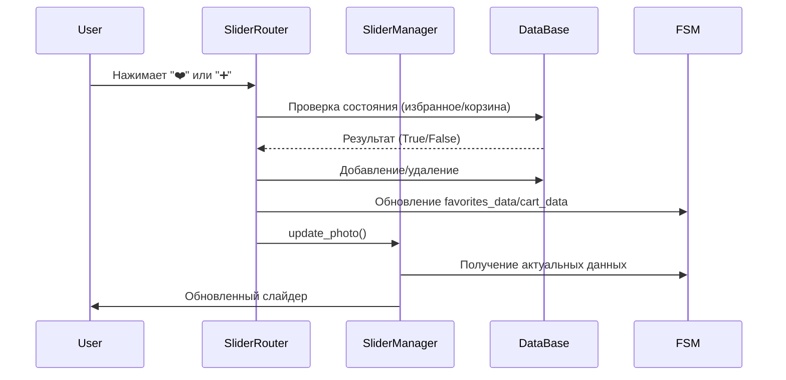

# 🎠 Slider Architecture Documentation

## Обзор

Слайдер - это центральный компонент для отображения товаров в виде интерактивного слайд-шоу. Поддерживает автоматическое проигрывание, навигацию, избранное, корзину и детальный просмотр.

## Архитектура

### Диаграмма компонентов

```mermaid
graph TB
    subgraph "Пользовательский интерфейс"
        User[👤 Пользователь]
        UI[📱 Telegram UI]
    end
    
    subgraph "Роутеры"
        SR[SliderRouter<br/>Обработчики действий]
        NR[NavigationRouter<br/>Навигация]
        CR[CatalogRouter<br/>Каталог]
    end
    
    subgraph "Менеджеры"
        SM[SliderManager<br/>Управление слайдером]
        MM[MessageManager<br/>Управление сообщениями]
        FM[FilterManager<br/>Управление фильтрами]
    end
    
    subgraph "Утилиты"
        FMU[format_media()<br/>Форматирование данных]
        VT[ViewTracker<br/>Отслеживание просмотров]
    end
    
    subgraph "Состояние"
        FSM[FSM<br/>Finite State Machine]
    end
    
    subgraph "Данные"
        DB[(DataBase<br/>База данных)]
        Cache[Кэш<br/>favorites_data<br/>cart_data]
    end
    
    User --> UI
    UI --> SR
    UI --> NR
    UI --> CR
    
    SR --> SM
    NR --> SM
    CR --> SM
    
    SM --> MM
    SM --> FMU
    SM --> VT
    SM --> FSM
    
    FSM --> Cache
    Cache --> DB
    
    FM --> FSM
    MM --> UI
```

### Основные компоненты

- **`SliderManager`** - основной класс управления слайдером
- **`SliderRouter`** - обработчики пользовательских действий
- **`format_media()`** - утилита форматирования данных
- **FSM (Finite State Machine)** - управление состоянием
- **DataBase** - хранение данных о товарах, избранном, корзине

### Диаграмма последовательности



## Детальное описание компонентов

### 1. SliderManager

#### Основные методы:

```python
class SliderManager:
    async def start_slider(self, media_list, product_ids, source="main", user_id=None, cart_items=None)
    async def update_photo(self, index, paused=False, expanded=True, user_id=None)
    async def autoplay_slideshow(self)
    async def _stop_previous_slideshow(self)
```

#### Жизненный цикл слайдера:

1. **Инициализация**: Создание экземпляра с MessageManager и FSM
2. **Запуск**: `start_slider()` форматирует данные и отправляет первое медиа
3. **Обновление**: `update_photo()` обновляет текущий слайд
4. **Автопроигрывание**: `autoplay_slideshow()` управляет автоматической сменой слайдов
5. **Остановка**: `_stop_previous_slideshow()` отменяет предыдущие задачи

### 2. SliderRouter

#### Обработчики действий:

```python
@router.callback_query(F.data.in_(["prev", "next", "pause", "play"]))
@router.callback_query(F.data.startswith("add_to_cart"))
@router.callback_query(F.data.startswith("remove_from_cart"))
@router.callback_query(F.data.startswith("detail_view:"))
@router.callback_query(F.data.startswith("favorite_"))
```

#### Основные функции:

- **Навигация**: prev/next, pause/play
- **Корзина**: добавление/удаление товаров
- **Избранное**: добавление/удаление из избранного
- **Детальный просмотр**: переход к детальному просмотру товара

### 3. Утилита format_media()

```python
def format_media(raw_media: list) -> tuple[list, list]:
    """
    Форматирует сырые данные медиа в формат для SliderManager
    
    Поддерживаемые форматы:
    - dict: {"path": "...", "media_type": "...", "caption": "..."}
    - tuple[6]: [id, product_id, file_id, media_type, is_main, caption]
    - tuple[3]: [id, product_id, file_id]
    """
```

## Состояния FSM

### Основные ключи состояния:

```python
{
    "index": 0,                    # Текущий индекс слайда
    "playing": False,              # Автопроигрывание активно
    "expanded": True,              # Клавиатура открыта
    "media_list": [...],           # Список медиа
    "product_ids": [...],          # ID товаров
    "user_id": 123,                # ID пользователя
    "favorites_data": {...},       # Кэш избранного
    "cart_data": {...},            # Кэш корзины
    "slider_source": "main",       # Источник запуска
    "speed": 3,                    # Скорость автопроигрывания
    "cycle_count": 0               # Счетчик циклов
}
```

## Поток данных

### 1. Запуск слайдера

```python
# Получение данных из БД
product_media = data_base.get_filtered_product_media(**filters)

# Форматирование
media, ids = format_media(product_media)

# Запуск
slider_manager = SliderManager(manager, state)
await slider_manager.start_slider(
    media_list=media, 
    product_ids=ids, 
    source="main", 
    user_id=user_id
)
```

### 2. Обновление состояния

```python
# При изменении избранного/корзины
await state.update_data(favorites_data=new_favorites)
await state.update_data(cart_data=new_cart)

# Обновление слайда
await slider_manager.update_photo(index, user_id=user_id)
```

### 3. Автопроигрывание

```python
# Запуск автопроигрывания
await state.update_data(playing=True, expanded=False)
await asyncio.create_task(slider_manager.autoplay_slideshow())
```

## Особенности реализации

### 1. Кэширование данных

Для оптимизации производительности используется кэширование:
- `favorites_data` - статус избранного для всех товаров
- `cart_data` - статус корзины для всех товаров

### 2. Обработка ошибок

```python
try:
    await self.mm.edit_media(media=input_media, reply_markup=markup)
except TelegramBadRequest:
    # Fallback: отправка нового сообщения
    await self.mm.send_media_message(...)
```

### 3. Отмена задач

```python
async def _stop_previous_slideshow(self):
    if self._current_task and not self._current_task.done():
        self._current_task.cancel()
        try:
            await self._current_task
        except asyncio.CancelledError:
            pass
```

## Интеграция с другими компонентами

### 1. Фильтры

```python
# Получение отфильтрованных товаров
active_filters = await FilterManager.get_active_filters(state)
product_media = data_base.get_filtered_product_media(**active_filters)
```

### 2. Корзина

```python
# Синхронизация корзины
cart_items = data_base.get_cart(user_id)
await state.update_data(cart_items=cart_items)
```

### 3. Избранное

```python
# Проверка избранного
is_favorite = data_base.is_product_in_favorites(user_id, product_id)
```

## Производительность

### Оптимизации:

1. **Кэширование**: Данные избранного и корзины кэшируются в FSM
2. **Ленивая загрузка**: Медиа загружается только при необходимости
3. **Отмена задач**: Предыдущие задачи отменяются при запуске новых
4. **Форматирование**: Данные форматируются один раз при запуске

### Мониторинг:

```python
# Логирование для отладки
logger.debug(f"start_slider: user_id={user_id}, product_ids={product_ids}")
logger.debug(f"update_photo: index={index}, is_favorite={is_favorite}")
```

## Расширение функциональности

### Добавление новых действий:

1. Создать обработчик в `SliderRouter`
2. Обновить клавиатуру в `get_slider_keyboard()`
3. Добавить логику в `SliderManager` при необходимости

### Добавление новых типов медиа:

1. Обновить `format_media()` для поддержки нового формата
2. Добавить обработку в `update_photo()`
3. Обновить `InputMedia*` выбор

## Тестирование

### Основные тесты:

- Запуск слайдера с разными источниками данных
- Навигация (prev/next)
- Автопроигрывание (play/pause)
- Избранное и корзина
- Детальный просмотр
- Обработка ошибок

### Пример теста:

```python
async def test_slider_navigation():
    # Подготовка
    media, ids = format_media(test_media)
    slider = SliderManager(manager, state)
    
    # Тест
    await slider.start_slider(media, ids)
    await slider.update_photo(1)  # Переход на второй слайд
    
    # Проверка
    data = await state.get_data()
    assert data["index"] == 1
```

## Примеры использования

### 1. Запуск слайдера из каталога

```python
# routers/catalog_router.py
@router.message(Command("catalog"))
async def handle_catalog_command(message: Message, state: FSMContext):
    # Получение отфильтрованных товаров
    active_filters = await FilterManager.get_active_filters(state)
    product_media = data_base.get_filtered_product_media(**active_filters)
    
    # Форматирование и запуск
    media, ids = format_media(product_media)
    slider_manager = SliderManager(manager, state)
    await slider_manager.start_slider(
        media_list=media, 
        product_ids=ids, 
        source="main", 
        user_id=user_id
    )
```

### 2. Обработка добавления в корзину

```python
# routers/slider_router.py
@router.callback_query(F.data.startswith("add_to_cart"))
async def handle_add_to_cart(callback: CallbackQuery, state: FSMContext):
    user_id = callback.from_user.id
    product_id = int(callback.data.split(":")[1])
    
    # Добавление в БД
    data_base.add_to_cart(user_id=user_id, product_id=product_id)
    
    # Обновление кэша
    cart_data = data.get("cart_data", {})
    cart_data[product_id] = True
    await state.update_data(cart_data=cart_data)
    
    # Обновление слайда
    slider_manager = SliderManager(manager, state)
    await slider_manager.update_photo(index, user_id=user_id)
```

### 3. Автопроигрывание

```python
# utils/slider_manager.py
async def autoplay_slideshow(self):
    while True:
        data = await self.state.get_data()
        if not data.get("playing", False):
            break
            
        current_index = data["index"]
        next_index = (current_index + 1) % len(media_list)
        
        await self.state.update_data(index=next_index)
        await self.update_photo(next_index, expanded=False)
        
        await asyncio.sleep(slider_speed)
```

### 4. Детальный просмотр

```python
@router.callback_query(F.data.startswith("detail_view:"))
async def handle_detail_view(callback: CallbackQuery, state: FSMContext):
    product_id = int(callback.data.split(":")[1])
    
    # Получение всех медиа товара
    media_list = data_base.get_product_media(product_id)
    
    # Создание детального caption
    detail_caption = await create_detail_caption(product, product_id, 0)
    
    # Отображение детального просмотра
    await callback.message.edit_media(
        media=InputMediaPhoto(media=file_id, caption=detail_caption),
        reply_markup=get_product_detail_keyboard(product_id, 0, len(media_list))
    )
```

## Отладка и мониторинг

### Логирование

```python
# Включение детального логирования
logger.debug(f"Slider state: {await state.get_data()}")
logger.debug(f"Media list length: {len(media_list)}")
logger.debug(f"Current index: {index}")
```

### Диагностические команды

```python
@router.callback_query(F.data == "debug_slider")
async def debug_slider(callback: CallbackQuery, state: FSMContext):
    data = await state.get_data()
    debug_info = {
        "index": data.get("index"),
        "playing": data.get("playing"),
        "media_count": len(data.get("media_list", [])),
        "favorites_count": len(data.get("favorites_data", {})),
        "cart_count": len(data.get("cart_data", {}))
    }
    await callback.answer(f"Slider debug: {debug_info}")
```

### Обработка ошибок

```python
try:
    await slider_manager.update_photo(index)
except Exception as e:
    logger.error(f"Slider update error: {e}")
    # Fallback: перезапуск слайдера
    await restart_slider(state, manager)
```

## Заключение

Слайдер представляет собой хорошо структурированный компонент с четким разделением ответственности. Архитектура позволяет легко расширять функциональность и поддерживать код. Использование FSM обеспечивает надежное управление состоянием, а кэширование оптимизирует производительность. 