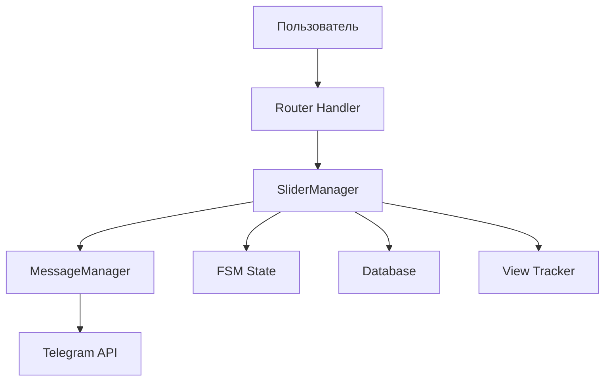

# 🔧 Слайдер - Руководство разработчика

## 📋 Содержание

1. [Архитектура](#архитектура)
2. [Основные компоненты](#основные-компоненты)
3. [API и методы](#api-и-методы)
4. [Интеграция](#интеграция)
5. [Расширение функциональности](#расширение-функциональности)
6. [Отладка и логирование](#отладка-и-логирование)
7. [Производительность](#производительность)
8. [Безопасность](#безопасность)

## 🏗 Архитектура

### Общая структура

```
SliderManager (utils/slider_manager.py)
├── MessageManager (utils/message_manager.py)
├── FSM State Management
├── Media Processing
├── Keyboard Generation
└── View Tracking
```

### Поток данных



## 🔧 Основные компоненты

### 1. SliderManager

**Файл**: `utils/slider_manager.py`

Основной класс для управления слайдером:

```python
class SliderManager:
    def __init__(self, manager: MessageManager, state: FSMContext):
        self.manager = manager
        self.state = state
        self.chat_id = manager.chat_id
```

**Ключевые методы**:
- `start_slider()` - запуск слайдера
- `update_photo()` - обновление текущего слайда
- `autoplay_slideshow()` - автопроигрывание
- `get_full_slider_caption()` - генерация подписи

### 2. SliderRouter

**Файл**: `routers/slider_router.py`

Обработчики callback-запросов:

```python
@router.callback_query(F.data.in_(["prev", "next", "pause", "play"]))
async def slideshow_controls(callback: CallbackQuery, state: FSMContext, manager: MessageManager):
    # Логика управления слайдером
```

### 3. Keyboard Generation

**Файл**: `keyboards/kb.py`

```python
def get_slider_keyboard(paused=False, expanded=True, index=0, total=0, 
                       user_id=None, is_favorite=False, product_id=None, 
                       source="main", is_in_cart=False):
    # Генерация клавиатуры слайдера
```

### 4. FSM States

**Файл**: `fsm/states.py`

```python
class SliderStates(StatesGroup):
    viewing = State()
    paused = State()
    expanded = State()
```

## 📡 API и методы

### Запуск слайдера

```python
from utils.slider_manager import SliderManager, format_media

# Получение данных
product_media = data_base.get_filtered_product_media(**filters)

# Форматирование медиа
media, ids = format_media(product_media)

# Создание менеджера
slider_manager = SliderManager(manager, state)

# Запуск слайдера
await slider_manager.start_slider(
    media_list=media,
    product_ids=ids,
    source="main",  # main, favorites, filters, sizes
    user_id=user_id,
    cart_items=cart_items  # опционально
)
```

### Обновление слайда

```python
await slider_manager.update_photo(
    index=current_index,
    paused=False,
    expanded=True,
    user_id=user_id
)
```

### Автопроигрывание

```python
# Запуск автопроигрывания
await asyncio.create_task(slider_manager.autoplay_slideshow())

# Остановка автопроигрывания
await state.update_data(playing=False)
```

### Генерация подписи

```python
caption = await slider_manager.get_full_slider_caption(
    product_id=product_id,
    user_id=user_id,
    cart_items=cart_items,
    show_cart_block=True
)
```

## 🔗 Интеграция

### Интеграция с корзиной

```python
# Добавление в корзину
@router.callback_query(F.data.startswith("add_to_cart"))
async def handle_add_to_cart(callback: CallbackQuery, state: FSMContext):
    product_id = int(callback.data.split(":")[1])
    user_id = callback.from_user.id
    
    # Добавление в БД
    data_base.add_to_cart(user_id, product_id)
    
    # Обновление слайдера
    await slider_manager.update_photo(...)
```

### Интеграция с избранным

```python
# Переключение избранного
@router.callback_query(F.data.startswith("toggle_favorite"))
async def handle_toggle_favorite(callback: CallbackQuery, state: FSMContext):
    product_id = int(callback.data.split(":")[1])
    user_id = callback.from_user.id
    
    # Переключение в БД
    data_base.toggle_favorite(user_id, product_id)
    
    # Обновление слайдера
    await slider_manager.update_photo(...)
```

### Интеграция с фильтрами

```python
# Запуск слайдера с фильтрами
async def start_filtered_slider(filters: dict, user_id: int):
    media_list = data_base.get_filtered_product_media(**filters)
    media, ids = format_media(media_list)
    
    await slider_manager.start_slider(
        media_list=media,
        product_ids=ids,
        source="filters",
        user_id=user_id
    )
```

## 🚀 Расширение функциональности

### Добавление новой кнопки

1. **Обновить клавиатуру**:

```python
def get_slider_keyboard(...):
    # Добавить новую кнопку
    new_button = [
        InlineKeyboardButton(text="🆕", callback_data="new_action")
    ]
    keyboard.inline_keyboard.append(new_button)
```

2. **Создать обработчик**:

```python
@router.callback_query(F.data == "new_action")
async def handle_new_action(callback: CallbackQuery, state: FSMContext):
    # Логика обработки
    await callback.answer("Новое действие выполнено!")
```

### Добавление нового типа медиа

1. **Обновить format_media()**:

```python
def format_media(media_list: List[Tuple]) -> Tuple[List[Dict], List[int]]:
    formatted_media = []
    product_ids = []
    
    for media in media_list:
        media_id, file_id, media_type, product_id = media
        
        if media_type == "new_type":
            formatted_media.append({
                "type": "new_type",
                "file_id": file_id,
                "media_id": media_id
            })
        # ... остальные типы
    
    return formatted_media, product_ids
```

2. **Обновить update_photo()**:

```python
async def update_photo(self, index: int, ...):
    media = self.media_list[index]
    
    if media["type"] == "new_type":
        input_media = InputMediaNewType(
            media=media["file_id"],
            caption=caption
        )
    # ... остальные типы
```

### Кастомные источники слайдера

```python
# Добавить новый источник
async def start_custom_slider(source: str, user_id: int):
    if source == "custom":
        # Логика получения данных для кастомного источника
        media_list = get_custom_media(user_id)
        media, ids = format_media(media_list)
        
        await slider_manager.start_slider(
            media_list=media,
            product_ids=ids,
            source="custom",
            user_id=user_id
        )
```

## 🐛 Отладка и логирование

### Включение логирования

```python
import logging

logger = logging.getLogger(__name__)
logger.setLevel(logging.DEBUG)

# Логирование состояния слайдера
logger.debug(f"Slider state: {await state.get_data()}")
logger.debug(f"Current index: {index}, Total: {len(media_list)}")
```

### Отладка проблем

```python
# Проверка состояния FSM
data = await state.get_data()
print(f"FSM Data: {data}")

# Проверка медиа
print(f"Media list length: {len(media_list)}")
print(f"Product IDs: {product_ids}")

# Проверка клавиатуры
keyboard = get_slider_keyboard(...)
print(f"Keyboard: {keyboard}")
```

### Обработка ошибок

```python
try:
    await slider_manager.update_photo(index)
except TelegramBadRequest as e:
    logger.error(f"Failed to update photo: {e}")
    # Fallback: отправка нового сообщения
    await manager.send_media_message(...)
except Exception as e:
    logger.error(f"Unexpected error: {e}")
    await callback.answer("Произошла ошибка", show_alert=True)
```

## ⚡ Производительность

### Оптимизация памяти

```python
# Очистка старых данных
async def cleanup_old_data(state: FSMContext):
    data = await state.get_data()
    if len(data.get("media_list", [])) > 100:
        # Ограничиваем количество медиа в памяти
        data["media_list"] = data["media_list"][:50]
        await state.update_data(**data)
```

### Кэширование

```python
# Кэширование данных пользователя
favorites_cache = {}
cart_cache = {}

async def get_user_data(user_id: int):
    if user_id not in favorites_cache:
        favorites_cache[user_id] = data_base.get_favorites(user_id)
    return favorites_cache[user_id]
```

### Асинхронная обработка

```python
# Параллельная загрузка данных
async def load_slider_data(filters: dict):
    tasks = [
        data_base.get_filtered_product_media(**filters),
        data_base.get_user_favorites(user_id),
        data_base.get_user_cart(user_id)
    ]
    
    media, favorites, cart = await asyncio.gather(*tasks)
    return media, favorites, cart
```

## 🔒 Безопасность

### Валидация данных

```python
def validate_slider_data(data: dict) -> bool:
    required_fields = ["media_list", "product_ids", "user_id"]
    
    for field in required_fields:
        if field not in data:
            return False
    
    # Проверка типов данных
    if not isinstance(data["user_id"], int):
        return False
    
    return True
```

### Проверка прав доступа

```python
async def check_user_permissions(user_id: int, product_id: int) -> bool:
    # Проверка блокировки пользователя
    if data_base.is_user_blocked(user_id):
        return False
    
    # Проверка доступности товара
    if not data_base.is_product_available(product_id):
        return False
    
    return True
```

### Защита от спама

```python
# Ограничение частоты запросов
from middlewares.anti_spam_middleware import rate_limit

@rate_limit(limit=10, window=60)  # 10 запросов в минуту
@router.callback_query(F.data.in_(["prev", "next"]))
async def handle_navigation(callback: CallbackQuery, state: FSMContext):
    # Обработка навигации
```

## 📊 Мониторинг

### Метрики производительности

```python
import time

async def measure_slider_performance():
    start_time = time.time()
    
    # Операция слайдера
    await slider_manager.update_photo(...)
    
    duration = time.time() - start_time
    logger.info(f"Slider update took {duration:.2f} seconds")
```

### Отслеживание ошибок

```python
async def track_slider_errors(error: Exception, context: dict):
    logger.error(f"Slider error: {error}")
    logger.error(f"Context: {context}")
    
    # Отправка уведомления администратору
    await notify_admin(f"Slider error: {error}")
```

## 🔄 Миграции и обновления

### Обновление схемы данных

```python
# Миграция для новых полей слайдера
async def migrate_slider_data():
    # Добавление новых полей в FSM
    await state.update_data(
        new_field="default_value"
    )
```

### Обратная совместимость

```python
# Проверка версии данных
def check_data_compatibility(data: dict) -> dict:
    if "new_field" not in data:
        data["new_field"] = "default_value"
    return data
```

## 📚 Дополнительные ресурсы

- [Telegram Bot API](https://core.telegram.org/bots/api)
- [aiogram Documentation](https://docs.aiogram.dev/)
- [FSM Documentation](https://docs.aiogram.dev/en/dev-3.x/dispatcher/finite_state_machine.html)
- [Примеры использования](../tests/)

---

*Это руководство поможет разработчикам эффективно работать со слайдером и расширять его функциональность.* 