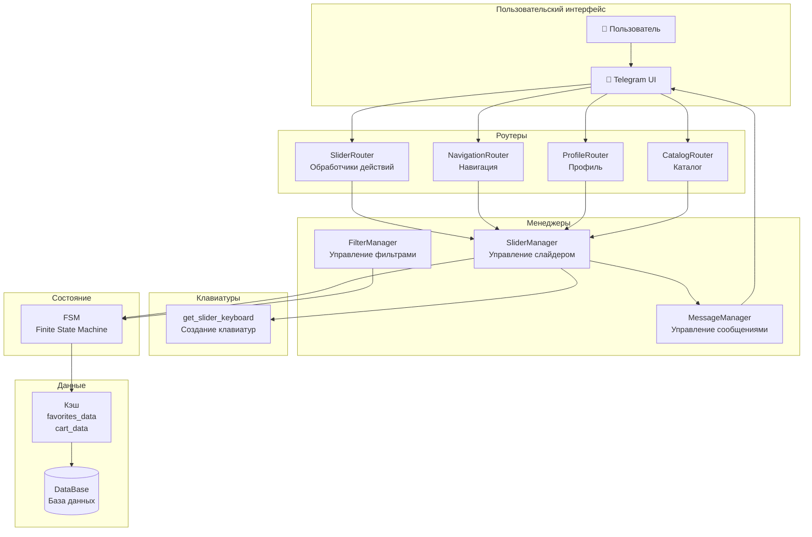
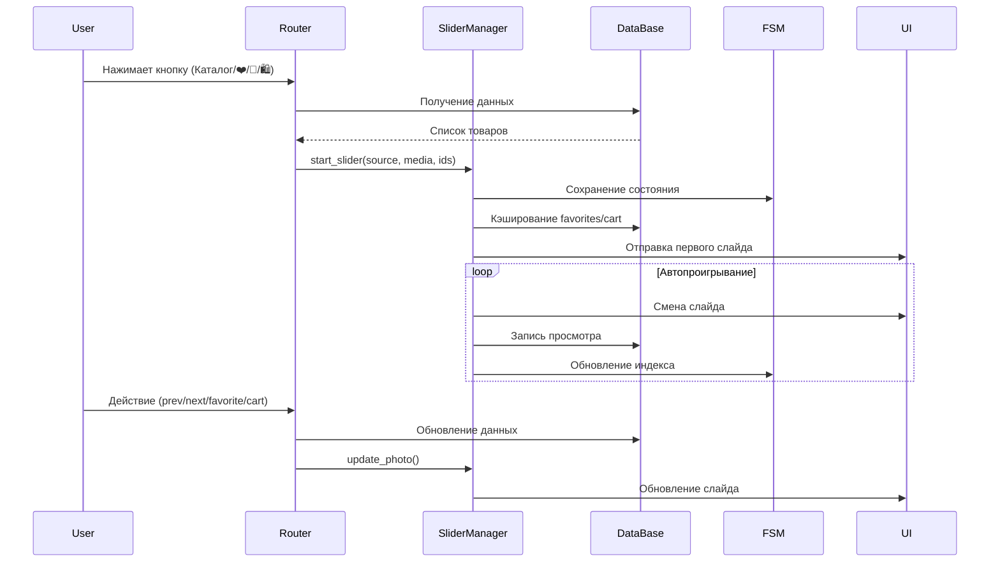
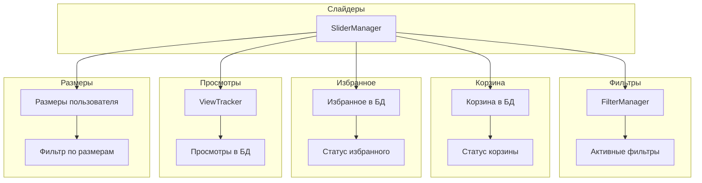

# Диаграммы типов слайдеров

## Обзор архитектуры слайдеров



## Типы слайдеров и их источники

```mermaid
graph LR
    subgraph "Источники запуска"
        MainMenu[Главное меню]
        Profile[Профиль]
        Filters[Фильтры]
        Cart[Корзина]
        Personal[🎯 Для меня]
    end
    
    subgraph "Типы слайдеров"
        MainSlider[Главный слайдер<br/>source="main"]
        FavoritesSlider[Слайдер избранного<br/>source="favorites"]
        FiltersSlider[Слайдер фильтров<br/>source="filters"]
        CartSlider[Слайдер корзины<br/>source="cart"]
        SizesSlider[Слайдер размеров<br/>source="sizes"]
    end
    
    subgraph "Особенности"
        Main[72 продукта<br/>Автопроигрывание]
        Fav[Dynamic update<br/>⭐ Избранное]
        Fil[Filtered items<br/>Fallback]
        Cart[Size info<br/>🛍 Корзина]
        Size[Personal fit<br/>🎯 Рекомендации]
    end
    
    MainMenu --> MainSlider
    Profile --> FavoritesSlider
    Filters --> FiltersSlider
    Cart --> CartSlider
    Personal --> SizesSlider
    
    MainSlider --> Main
    FavoritesSlider --> Fav
    FiltersSlider --> Fil
    CartSlider --> Cart
    SizesSlider --> Size
```

## Жизненный цикл слайдера



## Клавиатуры по типам слайдеров

```mermaid
graph TD
    subgraph "Общие кнопки (все слайдеры)"
        Nav[← → Навигация]
        Play[|| ᐅ Автопроигрывание]
        Cart[➕ ➖ Корзина]
        Info[інфо Детали]
    end
    
    subgraph "Специальные кнопки"
        Favorite[⭐ ☆ Избранное]
        Sizes[Размеры]
        Order[📝 Оформить заказ]
    end
    
    subgraph "Типы слайдеров"
        Main[Главный<br/>source="main"]
        Fav[Избранное<br/>source="favorites"]
        Fil[Фильтры<br/>source="filters"]
        Cart[Корзина<br/>source="cart"]
        Size[Размеры<br/>source="sizes"]
    end
    
    Main --> Nav
    Main --> Play
    Main --> Cart
    Main --> Info
    Main --> Favorite
    
    Fav --> Nav
    Fav --> Play
    Fav --> Cart
    Fav --> Info
    Fav --> Favorite
    
    Fil --> Nav
    Fil --> Play
    Fil --> Cart
    Fil --> Info
    Fil --> Favorite
    
    Cart --> Nav
    Cart --> Play
    Cart --> Cart
    Cart --> Info
    Cart --> Favorite
    Cart --> Order
    
    Size --> Nav
    Size --> Play
    Size --> Cart
    Size --> Info
    Size --> Favorite
```

## Состояние FSM для слайдеров

```mermaid
graph TD
    subgraph "Основные параметры"
        Index[index: 0<br/>Текущий слайд]
        Playing[playing: false<br/>Автопроигрывание]
        Expanded[expanded: true<br/>Клавиатура]
        Speed[speed: 3<br/>Скорость]
    end
    
    subgraph "Данные слайдера"
        MediaList[media_list: [...]<br/>Список медиа]
        ProductIds[product_ids: [...]<br/>ID товаров]
        Source[slider_source: "main"<br/>Тип слайдера]
        UserId[user_id: 123<br/>ID пользователя]
    end
    
    subgraph "Кэш данных"
        FavoritesData[favorites_data: {...}<br/>Кэш избранного]
        CartData[cart_data: {...}<br/>Кэш корзины]
    end
    
    subgraph "Счетчики"
        CycleCount[cycle_count: 0<br/>Счетчик циклов]
    end
    
    Index --> MediaList
    Playing --> Speed
    Expanded --> MediaList
    Source --> ProductIds
    UserId --> FavoritesData
    UserId --> CartData
    CycleCount --> Playing
```

## Поток данных в слайдерах

```mermaid
flowchart TD
    Start([Запуск слайдера]) --> GetData{Получение данных}
    
    GetData -->|source="main"| MainData[Все активные товары<br/>72 продукта]
    GetData -->|source="favorites"| FavData[Избранное пользователя]
    GetData -->|source="filters"| FilData[Отфильтрованные товары]
    GetData -->|source="cart"| CartData[Товары из корзины]
    GetData -->|source="sizes"| SizeData[Товары по размерам]
    
    MainData --> Format[Форматирование данных]
    FavData --> Format
    FilData --> Format
    CartData --> Format
    SizeData --> Format
    
    Format --> Cache[Кэширование favorites/cart]
    Cache --> Send[Отправка первого слайда]
    Send --> State[Сохранение в FSM]
    State --> Autoplay{Автопроигрывание?}
    
    Autoplay -->|Да| Play[Запуск автопроигрывания]
    Autoplay -->|Нет| Wait[Ожидание действий]
    
    Play --> Update[Обновление слайдов]
    Update --> Track[Отслеживание просмотров]
    Track --> Play
    
    Wait --> Action{Действие пользователя}
    Action -->|prev/next| Nav[Навигация]
    Action -->|favorite| Fav[Избранное]
    Action -->|cart| Cart[Корзина]
    Action -->|pause/play| Control[Управление]
    
    Nav --> Update
    Fav --> Update
    Cart --> Update
    Control --> Update
```

## Интеграция с другими компонентами



## Сравнение типов слайдеров

| Тип слайдера | Источник | Особенности | Кнопки | Возврат |
|-------------|----------|-------------|--------|---------|
| **Главный** | `source="main"` | 72 продукта, автопроигрывание | Базовые + ⭐ | Главное меню |
| **Избранное** | `source="favorites"` | Динамическое обновление | Базовые + ⭐ | Фильтры |
| **Фильтры** | `source="filters"` | Отфильтрованные товары | Базовые + ⭐ | Фильтры |
| **Корзина** | `source="cart"` | Размеры, количество | Базовые + ⭐ + 📝 | Главное меню |
| **Размеры** | `source="sizes"` | Персональные рекомендации | Базовые + ⭐ | Фильтры |

## Ключевые отличия

### 1. **Динамическое обновление**
- **Избранное**: Автоматическое обновление при изменении избранного
- **Корзина**: Обновление при изменении корзины
- **Остальные**: Статичные списки

### 2. **Caption товаров**
- **Корзина**: `🛍 корзина\nРозмір: L\nКількість: 2\n...`
- **Избранное**: `⭐ favorite\n...`
- **Остальные**: Стандартный caption

### 3. **Специальные кнопки**
- **Корзина**: Кнопка оформления заказа (закомментирована)
- **Все**: Кнопки избранного и корзины
- **Все**: Кнопки размеров после нажатия ➕

### 4. **Логика возврата**
- **Главный/Корзина**: Возврат в главное меню
- **Избранное/Фильтры/Размеры**: Возврат к фильтрам 